# Diabetes EDA Project (BRFSS 2015 Dataset)

## 📌 Overview
This project explores the [CDC BRFSS 2015 dataset](https://www.kaggle.com/datasets/cdc/behavioral-risk-factor-surveillance-system?select=diabetes_2015.csv) to analyze **patterns in diabetes prevalence** with respect to demographics, lifestyle, comorbidities, and healthcare access.

The project is structured in **three phases**:
1. **Phase 1 – Exploratory Data Analysis (this repo):** Visualize and interpret diabetes-related trends.
2. **Phase 2 – Analytical Study:** Evaluate drug efficacy in diabetes using Pandas.
3. **Phase 3 – Predictive Modeling:** Build ML models (Scikit-learn) to predict diabetes risk.

---

## 🧩 Dataset
- **Source:** CDC BRFSS 2015 (Behavioral Risk Factor Surveillance System)
- **Size:** 250k+ respondents
- **Key Features:**
  - Demographics: Age, Income, Sex
  - Lifestyle: Smoking, Physical Activity, Diet
  - Comorbidities: Hypertension, Heart Disease, Stroke
  - Health Outcomes: BMI, Mental Health, Physical Health
  - Target: Diabetes Outcome (0 = Non-Diabetes, 1 = Prediabetes, 2 = Diabetes)

---

## 🔍 Phase 1: Exploratory Data Analysis

### 1. Diabetes Outcome Distribution
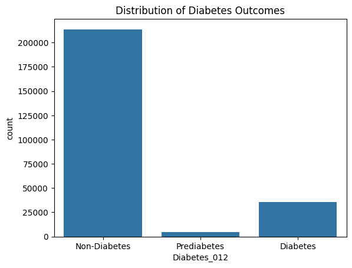  
📌 Most respondents are non-diabetic, with smaller shares of prediabetes and diabetes.

### 2. BMI Across Diabetes Status
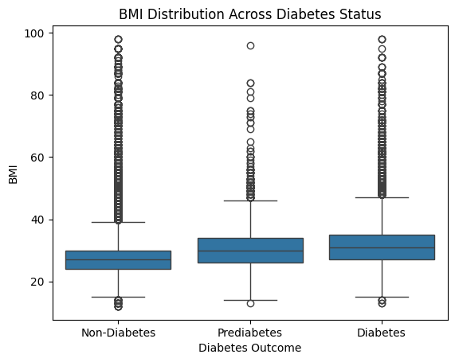  
📌 Diabetics show a noticeably higher BMI distribution.

### 3. Age and Diabetes Prevalence
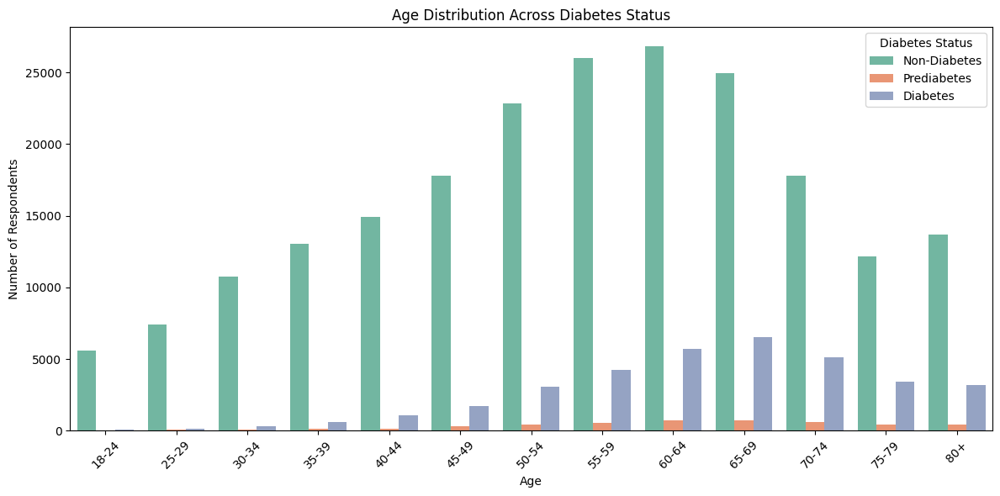  
📌 Diabetes prevalence increases sharply with age.

### 4. Income Distribution by Diabetes Status
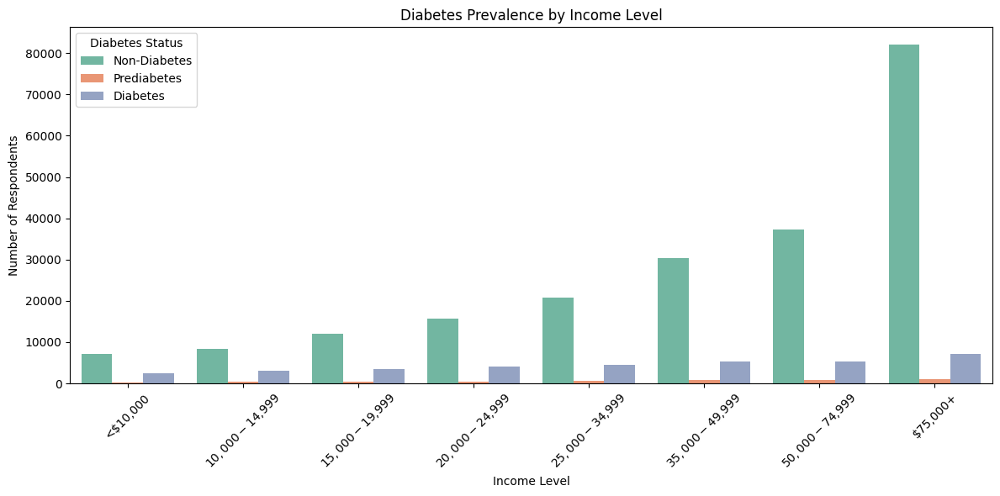  
📌 Diabetes is more common in lower income groups.

### 5. General Health Status by Diabetes Status
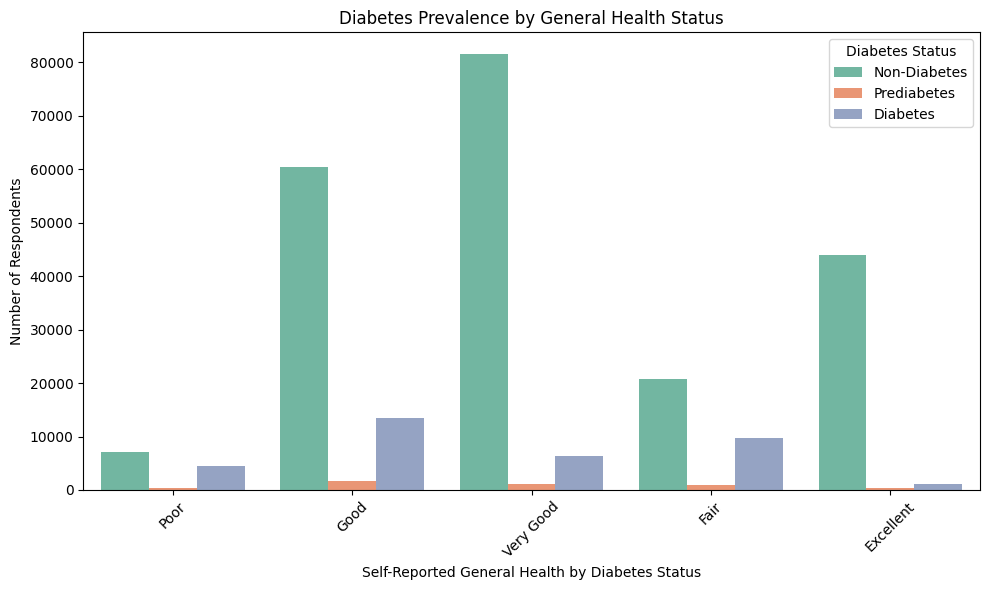  
📌 Those with diabetes report poorer general health.

### 6. Mental Health Days by Diabetes Status
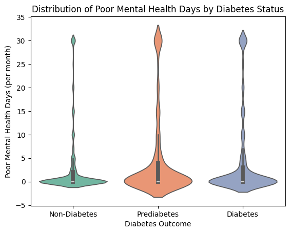  
📌 Diabetics report more days of poor mental health per month.

### 7. Physical Health Days by Diabetes Status
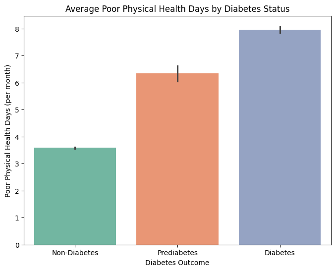  
📌 Diabetics report more days of poor physical health per month.

### 8. Smoking Status Distribution
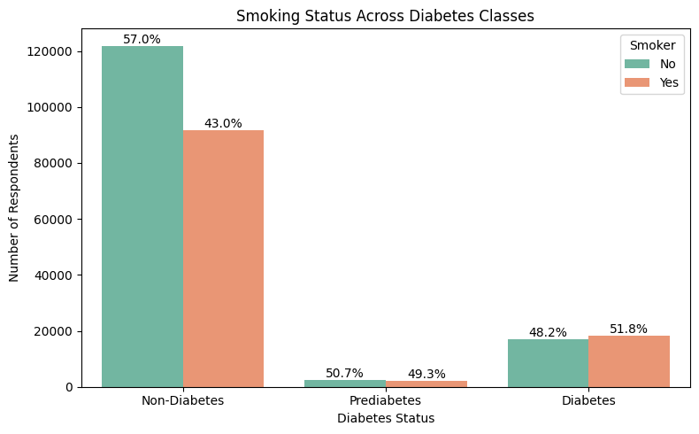  
📌 Smoking prevalence is higher among diabetics.

### 9. Physical Activity Levels
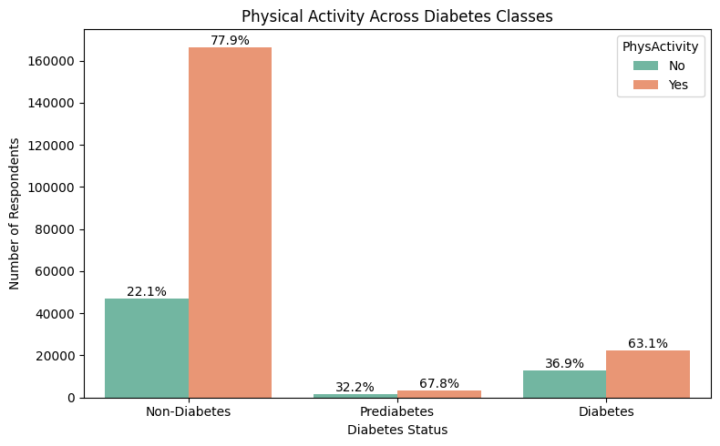  
📌 Physical inactivity is more common in diabetes groups.

### 10. Fruit Intake
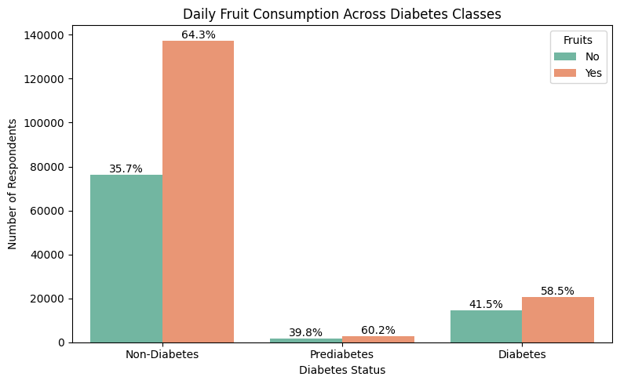  
📌 Diabetics report lower fruit consumption.

### 11. Vegetable Intake
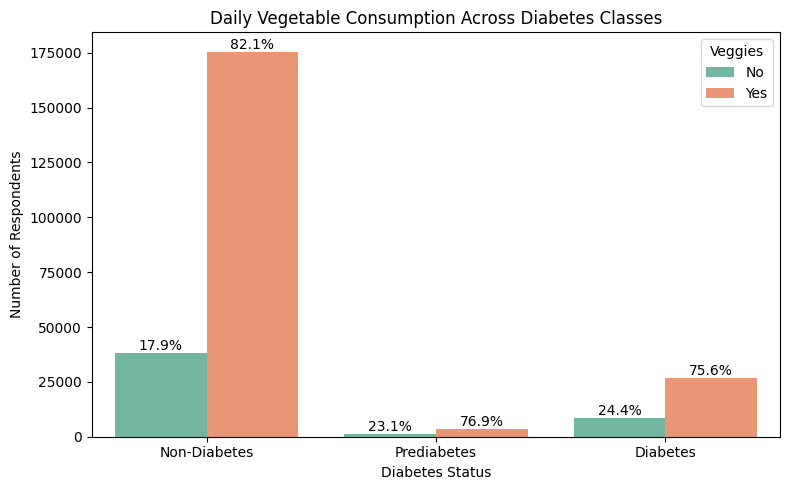  
📌 Diabetics report lower vegetable consumption.

### 12. Alcohol Consumption Patterns
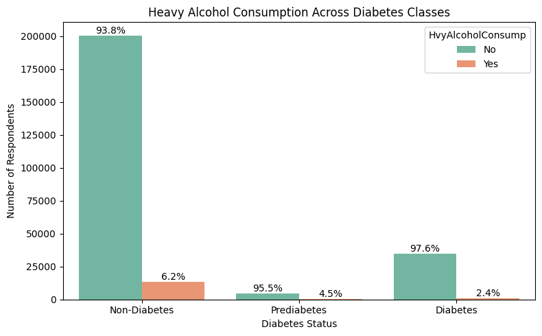  
📌 Diabetics tend to consume less alcohol.

### 13. Hypertension Prevalence
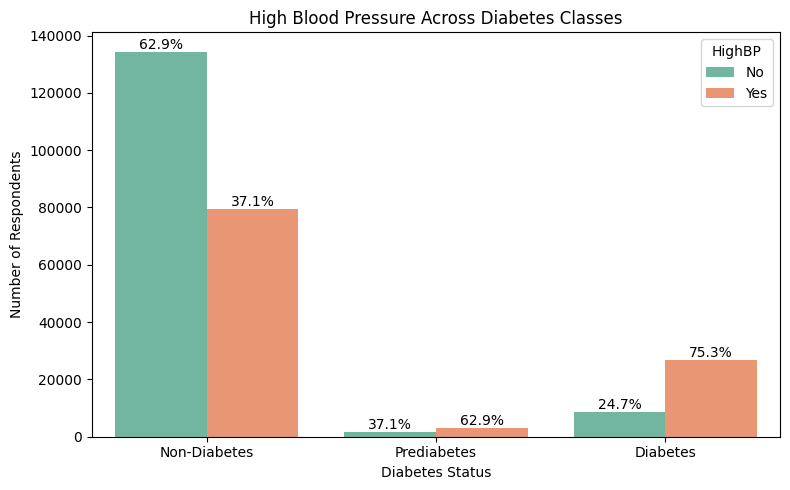  
📌 High blood pressure is highly comorbid with diabetes.

### 14. High Cholesterol Rates
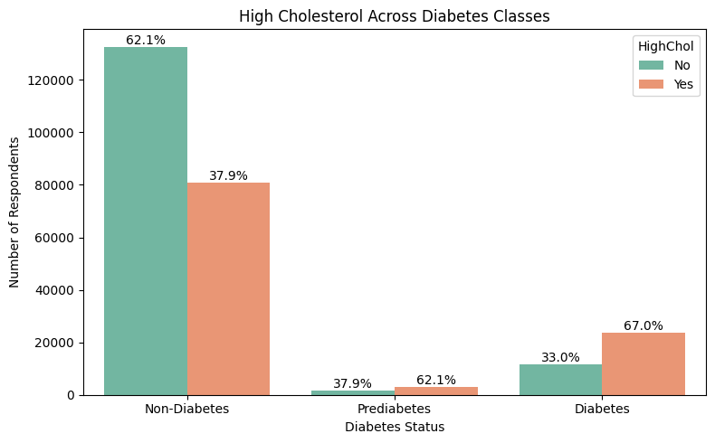  
📌 Elevated cholesterol is more frequent in diabetics.

### 15. Stroke History
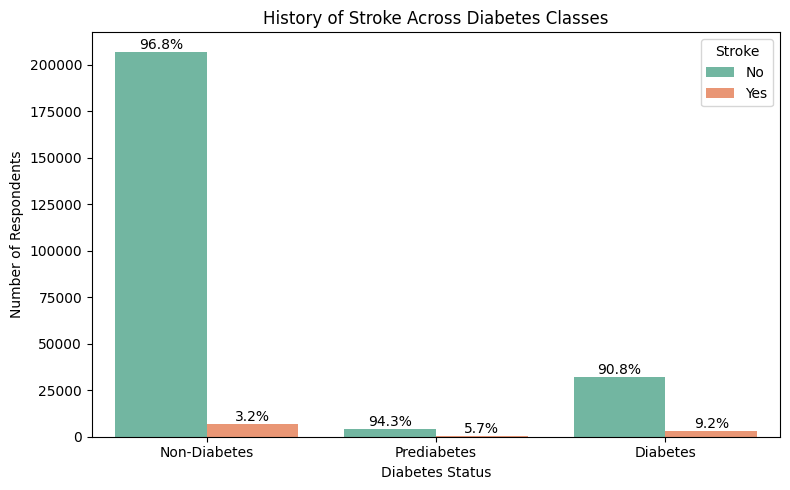  
📌 Stroke occurrences are more common among diabetics.

### 16. Heart Disease Presence
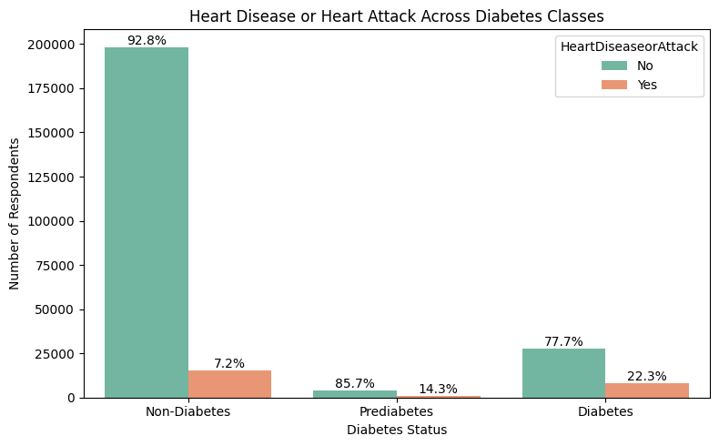  
📌 Heart disease is strongly associated with diabetes.

### 17. Healthcare Coverage Status
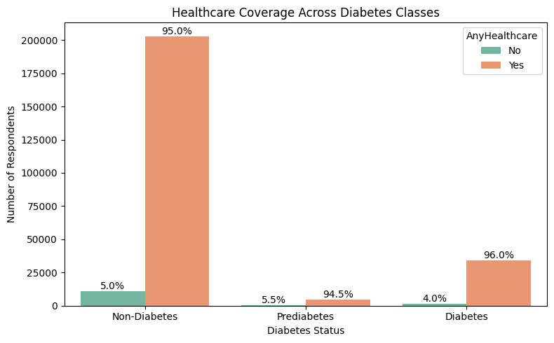  
📌 Diabetics are more likely to have healthcare coverage.

### 18. Cost Barriers to Medical Care
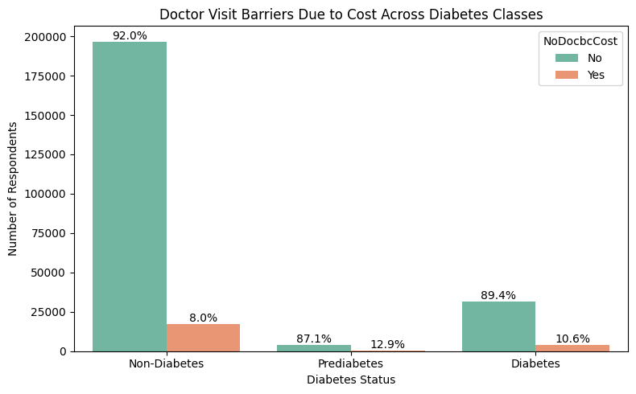
📌 Cost is a significant barrier to healthcare access in diabetics, highlighting financial barriers in care.

### 19. Difficulty Walking Across Diabetes Classes
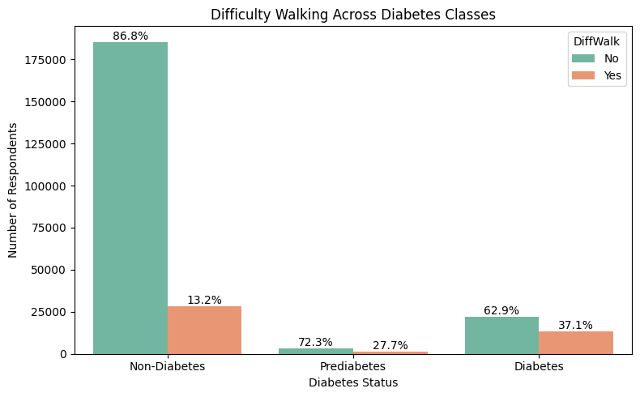  
📌 Diabetics are far more likely to report **difficulty walking**, consistent with neuropathy, obesity, and vascular disease.

### 20. The Relationship Between BMI and Poor Mental Health Days
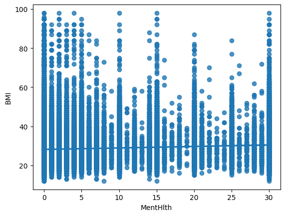  
📌 A weak positive association exists: **higher BMI is linked with slightly more poor mental health days**.

### 21. Correlation Heatmap of Key Variables
  
📌 BMI and Age show strong positive correlations with diabetes outcome.

---

## 📈 Key Insights
- **BMI and Age** are major correlates of diabetes.
- **Mental and physical health** deteriorate in diabetics.
- **Lower income** groups have higher diabetes prevalence.
- **Hypertension, heart disease, and stroke** are highly comorbid with diabetes.
- Lifestyle factors (smoking, inactivity, poor diet) cluster with higher diabetes risk.
- Healthcare access is generally better among diabetics, but cost remains a barrier.

---

## 🛠️ Tech Stack
- **Python** (Pandas, NumPy)
- **Seaborn & Matplotlib** for visualization
- **Jupyter Notebook** for analysis

---

## 🚀 Next Steps
- **Phase 2:** Pandas-based analysis of drug efficacy in diabetes treatment.
- **Phase 3:** Build predictive ML models for diabetes risk stratification.

---

## 👨‍⚕️ About Me
I’m **Iman Taheri, M.D.**, transitioning into data science with a focus on healthcare applications.  
This project bridges **clinical expertise** and **data analysis skills**, aimed at unlocking actionable insights in medical datasets.